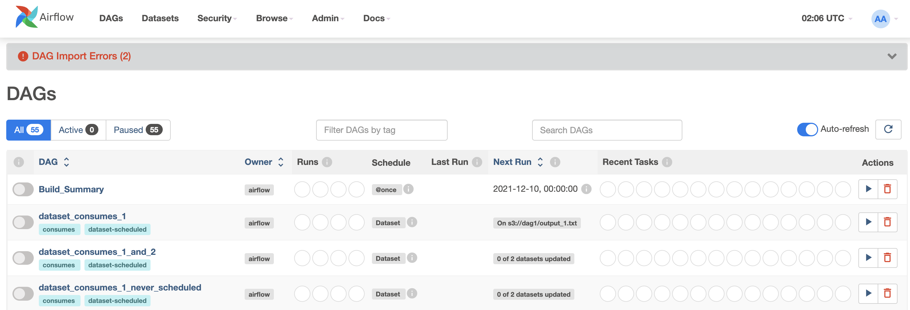

## Local Development
### One-Time Setup
#### Docker 설치
먼저 Docker를 설치하는 방법을 알아보자

1. [Docker Community Edition (CE)](https://docs.docker.com/engine/installation/)을 본인의 컴퓨터에 설치한다. 보통 최소 4GB의 메모리를 할당해야 도커가 정상적으로 동작하기에 사양이 낮은 컴퓨터라면 도커를 사용하지 않는 것이 낫다. 윈도우를 사용 중이라면 [Docker for Windows](https://docs.docker.com/docker-for-windows/#resources>)에서 Resources 섹션을 참고하고 맥을 사용 중이라면 [Docker for Mac](https://docs.docker.com/docker-for-mac/#resources)에서 Resources 섹션을 참고하기 바란다
2. 제대로 설치가 되었는지 확인하기 위해 `docker compose version` 명령을 실행한다. 최소 버전 1.29.1이나 그 이상의 버전이 필요하다.
```
 % docker compose version
Docker Compose version v2.15.1
```

#### Docker Settings
1. 최소 4GB (이상적으로는 8GB)의 메모리를 Docker에 할당한다. 이는 Settings -> Resources -> ADVANCED 메뉴에서 설정 가능하다

#### Install `pipenv`
The Docker image we use relies on `pipenv` to create a virtual environment with appropriate packages downloaded.

Run
```
$ pip3 install pipenv
```

Though the image itself has command to download `pipenv` to be used in the container, you want to make sure you can generate a `Pipfile.lock` file, since the container will ignore the `Pipfile` and use the `Pipfile.lock` to install packages.

For more information on `pipenv`, please refer to this [page](https://pipenv-fork.readthedocs.io/en/latest/basics.html).

### Spinning Up Local Airflow Services
1. data-engineering-batch12 리포를 다운로드받고 메인폴더로 이동한다. 여기 있는 dags 폴더가 결국 airflow dags 폴더가 되고 여기 있는 파이썬 파일들이 DAG로 인식된다.
```
git clone https://github.com/keeyong/data-engineering-batch12.git
cd data-engineering-batch12
```
2. Airflow 2.5.1에 해당하는 docker-compose.yaml을 다운로드받는다.
```
curl -LfO 'https://airflow.apache.org/docs/apache-airflow/2.5.1/docker-compose.yaml'
```
3. `docker compose up airflow-init`를 실행한다. 이 때 Redis와 Postgres가 실행되고 Airflow 설치가 완료된다.

4. Airflow를 실행하기 위해 `docker compose up` 명령을 실행한다.
5. `docker ps` 명령을 실행해서 모든 프로세스가 동작하는지 확인한다.
```
CONTAINER ID   IMAGE                  COMMAND                  CREATED          STATUS                   PORTS                    NAMES
416c95ae400e   apache/airflow:2.5.1   "/usr/bin/dumb-init …"   11 minutes ago   Up 3 minutes (healthy)   8080/tcp                 data-engineering-batch12-airflow-worker-1
b9c06238f108   apache/airflow:2.5.1   "/usr/bin/dumb-init …"   11 minutes ago   Up 3 minutes (healthy)   8080/tcp                 data-engineering-batch12-airflow-scheduler-1
d936e07d706f   apache/airflow:2.5.1   "/usr/bin/dumb-init …"   11 minutes ago   Up 3 minutes (healthy)   8080/tcp                 data-engineering-batch12-airflow-triggerer-1
34f28c6a0935   apache/airflow:2.5.1   "/usr/bin/dumb-init …"   11 minutes ago   Up 3 minutes (healthy)   0.0.0.0:8080->8080/tcp   data-engineering-batch12-airflow-webserver-1
e2abda41736f   postgres:13            "docker-entrypoint.s…"   53 minutes ago   Up 3 minutes (healthy)   5432/tcp                 data-engineering-batch12-postgres-1
67c5ffb14bec   redis:latest           "docker-entrypoint.s…"   53 minutes ago   Up 3 minutes (healthy)   6379/tcp                 data-engineering-batch12-redis-1
```
도커 프로그램에서 위의 프로세스들이 실행되고 있는지 다시 한번 확인한다

5. 브라우저를 열고 `http://localhost:8080/`로 접근한다. 다음과 같은 로그인 페이지가 보여야 한다:

6. 아래 정보로 로그인한다
    * username: `airflow`
    * password: `airflow`
7. 로그인하면 아래와 같은 페이지가 보여야 한다


### Airflow 컨테이너로 로그인하는 방법
1. `docker ps`를 실행하고 data-engineering-batch12-airflow-scheduler-1의 CONTAINER ID를 추출한다. 아래 예라면 b9c06238f108에 해당한다. 
```
CONTAINER ID   IMAGE                  COMMAND                  CREATED          STATUS                   PORTS                    NAMES
416c95ae400e   apache/airflow:2.5.1   "/usr/bin/dumb-init …"   11 minutes ago   Up 3 minutes (healthy)   8080/tcp                 data-engineering-batch12-airflow-worker-1
b9c06238f108   apache/airflow:2.5.1   "/usr/bin/dumb-init …"   11 minutes ago   Up 3 minutes (healthy)   8080/tcp                 data-engineering-batch12-airflow-scheduler-1
...
```
2. Container ID("b9c06238f108")를 바탕으로 `docker exec -it b9c06238f108 sh`를 실행한다. 그러면 셀 모드로 들어갈 수 있고 거기서 airflow 명령어를 실행할 수 있다. 소스 코드 편집은 앞서 코드리포를 다운로드 받은 폴더(data-engineering-batch12) 밑의 dags 폴더를 사용하면 된다.
```
% docker exec -it b9c06238f108 sh
(airflow)airflow tasks list HelloWorld
/home/airflow/.local/lib/python3.7/site-packages/airflow/models/base.py:49 MovedIn20Warning: [31mDeprecated API features detected! These feature(s) are not compatible with SQLAlchemy 2.0. [32mTo prevent incompatible upgrades prior to updating applications, ensure requirements files are pinned to "sqlalchemy<2.0". [36mSet environment variable SQLALCHEMY_WARN_20=1 to show all deprecation warnings.  Set environment variable SQLALCHEMY_SILENCE_UBER_WARNING=1 to silence this message.[0m (Background on SQLAlchemy 2.0 at: https://sqlalche.me/e/b8d9)
print_goodbye
print_hello
```

### Shutting Down Local Airflow Services
1. `ctrl+c`

2. Run `docker compose down`


### Volumes
Since the `docker-compose.yaml` file takes care of mounting the `./dags` folder for us. You can start developing your code and create DAGs in the `./dag` folder the same way we used to do on the Airflow server. Anything you changes there should be reflected in the container locally running Airflow.

### Cleanup
It's recommended that you clean up dangling Docker images resulted from multiple build versions from time to time to free up space on your machine. To do this please run: `docker system prune`

When prompted:
```
WARNING! This will remove:
  - all stopped containers
  - all networks not used by at least one container
  - all dangling images
  - all dangling build cache

Are you sure you want to continue? [y/N]
```
please answer: `y` then hit `enter` key

### Advance Usage
#### Adding Packages
1. Add package to `requirements.txt`
2. Run `pipenv install -r requirements.txt`
3. To spin up Airflow with new changes, run `docker-compose up --build`

Note: Installing from `requirements.txt` via `pipenv` only appends packages to the `Pipfile` file. The installation does NOT remove packaged already in `Pipfile` that are not in the `requirements.txt` file
